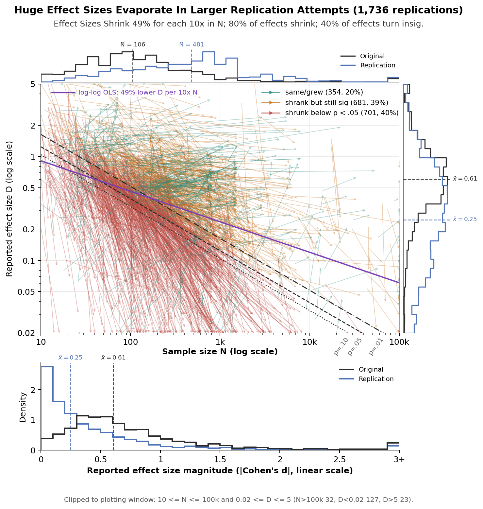
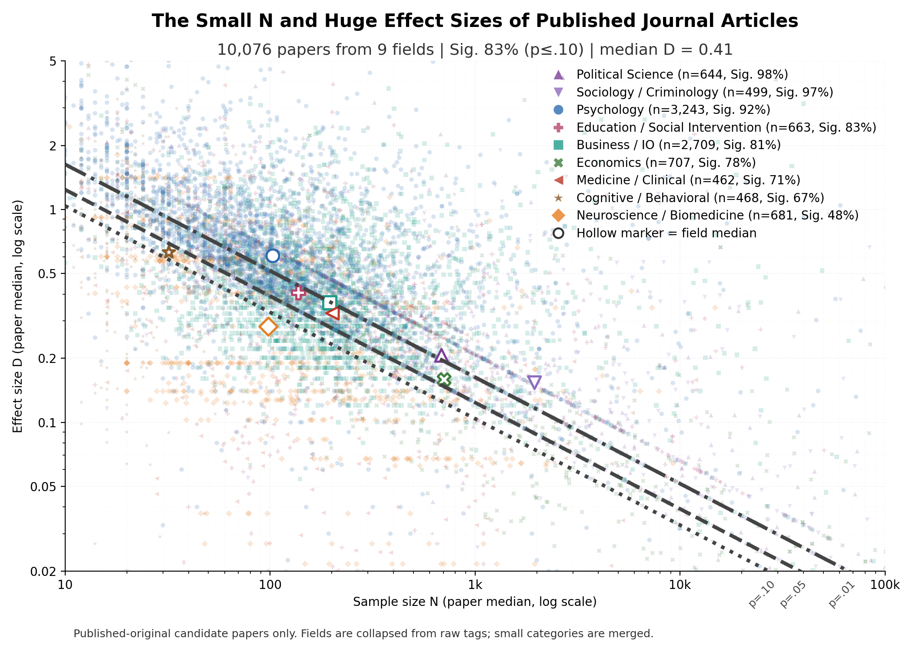
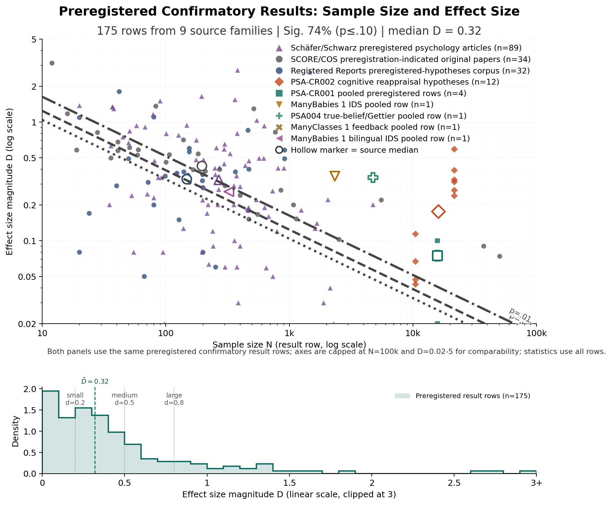
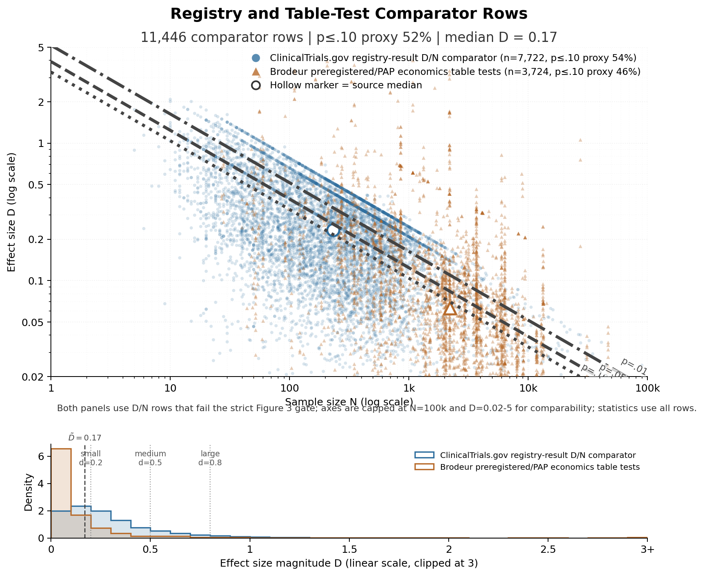
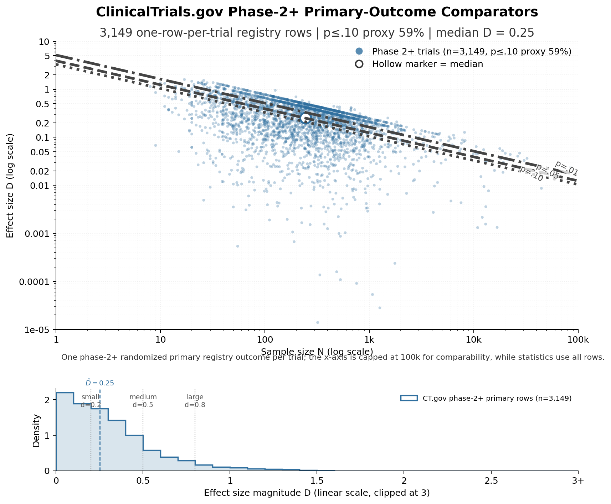
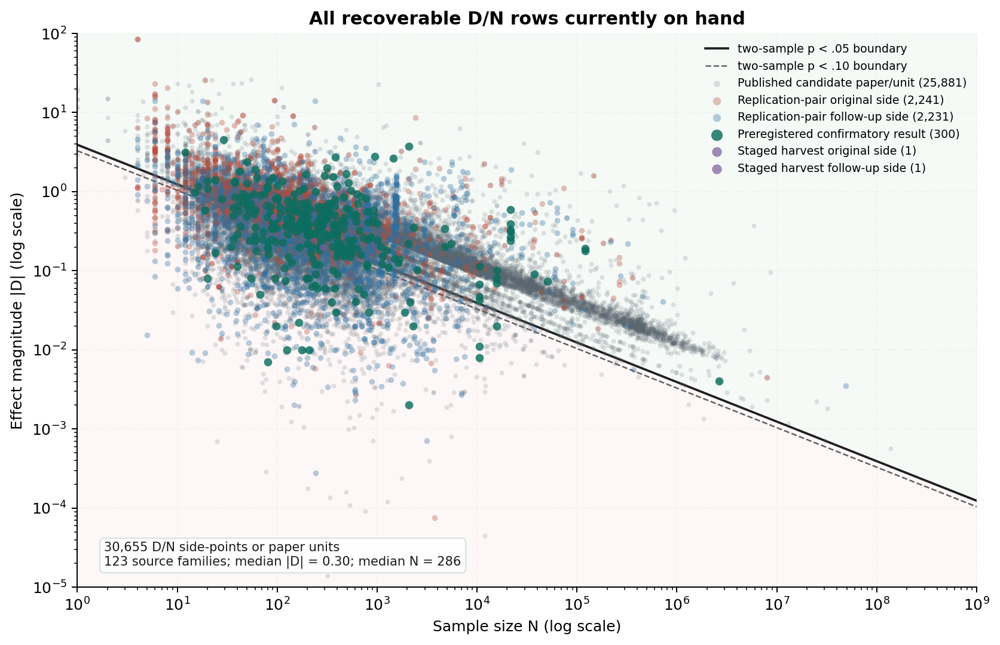

```{=html}
<p class="byline">Rex W. Douglass PhD — <a href="https://www.rexdouglass.com">rexdouglass.com</a> — April 24, 2026</p>
<div class="dataset-kicker">Technical companion / source audit / construction dossier</div>
<nav class="dataset-contents" aria-label="Contents">
  <div class="dataset-contents-title">Contents</div>
  <ul>
    <li><a href="#abstract">Abstract</a></li>
    <li><a href="#purpose">Purpose</a></li>
    <li><a href="#plot-1-replication-pairs">Plot 1 — Replication Pairs</a></li>
    <li><a href="#plot-2-published-paper-endpoints">Plot 2 — Published Paper Endpoints</a></li>
    <li><a href="#plot-3-preregistered-results">Plot 3 — Preregistered Results</a></li>
    <li><a href="#plot-4-all-source-dn-dump">Plot 4 — All-Source D/N Dump</a></li>
    <li><a href="#relation-to-the-main-manuscript">Relation to the Main Manuscript</a></li>
    <li><a href="#remaining-gaps">Remaining Gaps</a></li>
    <li><a href="#conclusion">Conclusion</a></li>
    <li><a href="#appendix-integration-queue">Appendix Integration Queue</a></li>
  </ul>
</nav>
```

# Abstract {.unnumbered}

This companion paper documents the construction of the **Effect Inflation Dataset**, the source-audited corpus used to study how published small-$N$ effect sizes compare with later larger-sample follow-ups. The goal of the dataset is narrower than the goal of the main paper. The main paper argues that most published small-$N$ claims are inflated. This paper explains exactly **which sources were searched, which were included, which were blocked, how rows were coded, and why particular design choices were made**.

The dataset currently has two distinct layers. The first is a **live integrated pair corpus** used for the cross-source `D`-based analyses in the main manuscript. The second is a broader **staging and audit layer** that records sources that were real but not yet promotable under the current shared-metric rules. Keeping these layers separate is deliberate. It prevents weak or poorly matched sources from contaminating the live corpus while preserving a detailed audit trail of what was tried and what remains recoverable.

# Purpose

This dataset paper is now organized around the **plot program** rather than around a generic workflow taxonomy.

The logic is simple:

- **Plot 1** is the replication-pairs plot,
- **Plot 2** is the published-paper endpoint plot,
- **Plot 3** is the preregistered-results plot,
- **Plot 4** is the first-pass all-source `D`/`N` dump.

Each figure section now follows the same plot-first audit structure:

1. the figure,
2. inclusion criteria,
3. corpora considered, with citation, description, in/out rationale, and observation count,
4. specific observations included, with row-level paper/result details where the project has them.




# Plot 1 --- Replication Pairs

This is the most mature plot in the project. It is the cross-source original-versus-larger-follow-up figure used in the main manuscript.

## Figure






## Current Files

The current replication-pair stack lives in a small set of derived files.

- Live integrated pair table: [replication_pairs_all_on_hand.csv](../data/derived/replication_pairs/replication_pairs_all_on_hand.csv)
- Figure 2 rule-qualified subset: [replication_pairs_figure2_rule_subset.csv](../data/derived/replication_pairs/replication_pairs_figure2_rule_subset.csv)
- Source-level inclusion catalog: [replication_pair_source_catalog.csv](../data/derived/replication_pairs/replication_pair_source_catalog.csv)
- Lead-attempt manifest: [harvest_manifest.csv](../data/derived/replication_pairs/harvest/harvest_manifest.csv)
- Queue/status mirror: [lead_queue_status.csv](../data/derived/replication_pairs/harvest/lead_queue_status.csv)
- Human-readable mining log: [overnight_mining_status.md](../data/derived/replication_pairs/harvest/overnight_mining_status.md)
- Exhaustive evidence-surface inventory: [replication_source_evidence_inventory.csv](../data/derived/replication_pairs/replication_source_evidence_inventory.csv)
- Consolidated source audit: [replication_source_audit.csv](../data/derived/replication_pairs/replication_source_audit.csv)
- Prioritized source worklist: [replication_source_worklist.csv](../data/derived/replication_pairs/replication_source_worklist.csv)
- Human-readable audit summary: [replication_source_audit.md](../reports/replication_source_audit.md)
- Staged partial or blocked harvests: [harvest/staged](../data/derived/replication_pairs/harvest/staged)
- Promoted source-specific pair tables: [harvest/promoted](../data/derived/replication_pairs/harvest/promoted)



## Unit of Analysis

The unit of analysis in the live replication corpus is **not** “one paper” and **not** “one raw effect row from every source.” It is a **paper-endpoint pair** after source-specific cleanup.

That means:

- one original paper can contribute more than one row if it makes more than one distinct claim or endpoint,
- one replication paper can contribute more than one row if it reports multiple distinct endpoints,
- obvious site-level repeats can be collapsed when they are clearly the same original paper × replication study × endpoint anchor,
- and sources that are naturally effect-level can still be harmonized to this cleaner endpoint-pair unit.

This choice avoids two different failure modes:

- **paper-level collapse** throws away real endpoint distinctions,
- **raw effect-row ingestion** creates fake multiplicity from lab splits, repeated labels, or within-paper redundancies.

## Construction Workflow

### Lead Discovery

Leads come from three broad routes:

- known replication projects and curated databases,
- manual mining of supplements, OSF/GitHub/Dataverse payloads, and public workbooks,
- source suggestions that require follow-up inspection.

Each lead is logged in the structured harvest files. The first-pass explanation of why a source did or did not make it usually begins in the lead manifest fields:

- `terminal_status`
- `access_class`
- `directness_class`
- `metric_class`
- `promotion_blocker`
- `next_action`
- `notes`

### Staging

A source is staged when it is real, relevant, and worth preserving, but still not ready for the live corpus. Typical reasons include:

- the source is roster-only,
- the source has endpoint matches but no defensible common-metric effect yet,
- the source is native-metric only,
- the source is public but still needs parser work,
- the source overlaps an already integrated source and needs deduplication,
- or the source is promising but still blocked by partial access.

The staged directory is therefore a working archive, not a final dataset.

### Promotion

A source is promoted when it yields rows that satisfy the current live-corpus schema:

- `original_title`
- `replication_title`
- `original_doi`
- `replication_doi`
- `outcome`
- `D_original`
- `N_original`
- `D_replication`
- `N_replication`

along with provenance fields such as `raw_file` and `match_author`.

Promotion is intentionally conservative. If the endpoint match is weak, the metric conversion is unstable, or the sample-size anchor is missing, the row stays staged rather than entering the live corpus.

### Integration

The final integration step rebuilds the live pair tables and Figure 2 inputs from:

- built-in source handlers inside [analyze_replication_pairs.py](../scripts/analyze_replication_pairs.py),
- plus every promoted CSV under [harvest/promoted](../data/derived/replication_pairs/harvest/promoted).

This separation matters. The integrated corpus is reproducible from code and promoted artifacts, not from ad hoc spreadsheet edits.

## Inclusion and Metric Rules

### Core Pair Logic

The live corpus prefers sources where the following are true:

- one earlier original study can be identified,
- one later larger new-sample study can be identified,
- the outcome or claim is the same or defensibly harmonized,
- the effect can be placed on a common axis,
- both sample sizes are known,
- and the later study is in fact larger.

### Figure 2 Rule Subset

The stricter Figure 2 subset applies additional rules:

- both sides must have a usable common-metric effect size on the shared `D` axis,
- both sample sizes must be known and at least 10,
- the replication must be larger than the original,
- and obvious site-level repeats are collapsed to one endpoint-pair row when justified.

That is why many real checked sources exist in the audit trail but not in the plotted subset.

### Why a Shared `D` Axis Was Used

The live cross-source corpus uses a shared `D`-like axis because it needs one common magnitude scale across literatures that report:

- standardized mean differences,
- correlations,
- odds ratios,
- hazard ratios,
- test statistics,
- and a variety of partially standardized summaries.

The point of the shared axis is narrow: compare the size of the original claim with the size of the larger follow-up claim on one common scale.

### Why Percent Changes Were Not Used as the Common Axis

Percent changes and related “x% better” summaries are often denominator-sensitive. If the baseline is tiny, a trivial absolute change can look enormous in percent terms. That makes them too unstable for the main cross-study distribution.

For example, a move from `1%` to `2%` is a `100%` increase even though it is only a one-point absolute shift. That is exactly the wrong property for a dataset meant to compare magnitudes across very different domains.

### The Problems of `D`

`D` is not neutral.

It can be inflated when:

- the pooled SD is unusually small,
- the sample is range-restricted,
- the subgroup is unusually homogeneous,
- the design is clustered or repeated-measures and the necessary structure is not fully recoverable,
- or the source metric has to be back-converted from ratios or adjusted models.

It also removes natural units and can hide baseline risk or direct clinical meaning. The project uses `D` because it is the least bad common axis for the replication-pairs plot, not because it is a perfect one.

### Native-Metric Rows

Some sources are clearly real and clearly informative but should not yet be promoted to the live `D`-based replication corpus. This is especially common in:

- pilot/full-scale medical pairs,
- cluster-adjusted mean-difference studies,
- hazard-ratio survival endpoints,
- sources that only expose a defensible native metric.

Those rows belong in staging unless and until a separate native-metric lane is formalized.

## Why Checked Sources Still Miss the Live Plot

The most common exclusion or blocking reasons currently fall into a few recurring classes.

### Access Blocked

The source exists but the public payload is unavailable, restricted, empty, or not machine-retrievable in the current environment.

### Parser Not Implemented

The source is public and probably usable, but no project-specific extractor has been written yet.

### Endpoint Mismatch

The original and follow-up papers are about the same intervention family but not the same endpoint. These sources are often scientifically interesting and still valuable as staged records, but they do not belong in the strict agreement analyses.

### Metric Blocked

The source has real pair information, but the effect metrics do not support a defensible shared-`D` conversion under the current policy.

### Overlap or Duplicate Coverage

The source is real but duplicates or mirrors another already integrated source. In those cases it is useful as a cross-check, not as a new source of rows.

### Roster-Only

The source identifies pairs but does not expose the per-pair analytic effect and sample-size table. This is now the status of the current Ying dissertation roster extraction.

## Manual Recovery and the Ying Example

The current Ying 2023 work is a good example of why the audit layer matters.

The project now has:

- a verified `248`-pair bibliographic roster extracted from the dissertation,
- a staged partial reconstruction file,
- and one promoted pair that cleared the current `D`-based live-corpus rules.

That is not a failure of the source. It is an honest reflection of the difference between:

- “this source is real and worth preserving,”
- “this source gives us a pair roster,”
- “this source gives us native-metric evidence,”
- and “this source yields a fully promotable shared-`D` row right now.”

This distinction should become standard across the whole replication-pairs layer.

# Plot 2 --- Published Paper Endpoints

This is the paper-level `D`-vs-`N` cloud used to show what the published literature looks like before replication correction.

## Figure



## Inclusion Criteria

Plot 2 currently includes a source corpus when all of the following are true:

- the source yields **published-paper rows** rather than only replication-pair rows, registry rows, or pure meta-analytic summaries,
- a paper-level `D` and `N` can be recovered or aggregated,
- paper grouping is recoverable, so one plotted point can correspond to one published paper after source-specific cleanup,
- and the resulting paper-level cloud can be integrated without pretending that the project has already identified the one true headline result in every paper.

That last clause matters. Plot 2 is not yet a “main result only” figure. It is a paper-level published-result surface. So some sources are currently excluded not because they are uninteresting, but because they still fail one of the more basic gating conditions above.




## Current Files

The current published-endpoint stack now has a plot-specific source audit plus the row-level paper details used to draw the cloud:

- Candidate published-paper corpus: [candidate_d_n_papers.csv](../data/derived/corpus_candidates/candidate_d_n_papers.csv)
- Published field-group map: [candidate_published_field_groups.csv](../data/derived/corpus_candidates/candidate_published_field_groups.csv)
- Plot 2 source-corpus catalog: [plot2_published_source_catalog.csv](../data/derived/effect_inflation_dataset/plot2_published_source_catalog.csv)
- Plot 2 paper-level detail rows: [plot2_published_paper_details.csv](../data/derived/effect_inflation_dataset/plot2_published_paper_details.csv)
- Plot 2 criterion matrix: [plot2_published_criteria_matrix.csv](../data/derived/effect_inflation_dataset/plot2_published_criteria_matrix.csv)
- Corpus bibliography inventory: [corpus_papers.csv](../data/derived/bibliography/corpus_papers.csv)
- Corpus bibliography BibTeX: [corpus_papers.bib](../data/derived/bibliography/corpus_papers.bib)

The older [published_original_paper_d_vs_n.csv](../data/derived/published_papers/published_original_paper_d_vs_n.csv) file is retained as a legacy summary from the earlier two-corpus draft path. It is no longer the feeder for the rendered Plot 2 figure or the Plot 2 source catalog.

## What This Plot Currently Means

The current plot treats each published-original paper as one point, using a paper-level median `D` and median `N` after source-specific cleanup. It is therefore not a raw all-effects dump and not a pure one-paper-one-estimate registry. It is a harmonized paper-level endpoint cloud.

That design makes the plot interpretable, but it also means this layer needs its own audit standard. Section 3.3 is the current source-family admission audit: it records every considered corpus, why it was a plausible candidate, what fields were actually confirmed, why it is in or out, and how many paper/unit rows enter the cloud. The remaining gap is source-specific collapse-rule prose for several included corpora, not the existence of the audit table itself.

## What Still Needs to Tighten

The source-family audit is now centralized in Section 3.3 and in [plot2_published_source_catalog.csv](../data/derived/effect_inflation_dataset/plot2_published_source_catalog.csv). The remaining cleanup is more specific:

- one explicit statement of paper-level collapse rules by source family,
- follow-up decisions for the high-yield excluded candidates that need parser, access, or policy work,
- and one clearer distinction between the plot-ready paper-level cloud and any future all-source row dump.

# Plot 3 --- Preregistered Results

Plot 3 now has a first rendered version built from the preregistered-results files already on hand. It is a comparison layer, not a registry layer: each point is a preregistered confirmatory result with a recoverable `D` and `N`.

## Figure



## Registry and Table-Test Comparators

Figure 3 is restricted to preregistered confirmatory result rows: one row should correspond to a precommitted hypothesis/result with recoverable `D` and `N`. The comparator panel below deliberately shows two large local sources that are close enough to inspect but not comparable enough to enter Figure 3.

- **ClinicalTrials.gov registry-result comparator:** `7,722` trial-level registry-result rows from the local finer-grained CT.gov efficacy extraction. These are collapsed registry rows with `D/N` derived from registry p-values and enrollment-like `N`, not locked article-level confirmatory analyses.
- **Brodeur preregistered/PAP economics table tests:** `3,724` extracted economics table-test rows from papers flagged as preregistered, having a pre-analysis plan, or having PAP power information. The flags are paper/PAP-level evidence, while the plotted rows are individual published coefficients/tests.

They stay out of Figure 3 for opposite reasons. CT.gov fails the analytic-prespecification gate: a registered primary outcome is not the same as a locked statistical analysis plan, and the local effect is a p-value/enrollment proxy. Brodeur fails the row-unit gate: the data are many table tests per paper, with no source-provided focal hypothesis selector proving that each coefficient is the prespecified confirmatory test. The point of this panel is therefore diagnostic, not inferential: it shows what happens when we loosen the Figure 3 row definition to include preregistered-like registry and table-test evidence.



The cleaner ClinicalTrials.gov panel below applies the strongest fully local rule we can support right now: phase-2+ randomized interventional trials with exactly one locally eligible primary two-group outcome row, plotted one row per trial. This fixes much of the multiplicity problem, but it still remains outside Figure 3 because `D` is still a registry p-value/enrollment proxy and the row has not been matched to a locked protocol or SAP analysis.



## Inclusion Criteria

Plot 3 should include a source family when:

- the row family represents **preregistered confirmatory results** rather than post hoc exploratory findings,
- `D` and `N` are recoverable or already encoded at the row level,
- the source is public and locally auditable,
- and the unit is a preregistered hypothesis/result row, not merely a registry entry or broad study metadata record.

That is why mere clinical-trial registration is not enough for this layer. Registration can still be useful as a comparator, but it is not the same thing as an analytically preregistered confirmatory result.




## Current Files

- Preregistered hypotheses corpus: [table_40_preregistered_hypotheses_scheel_2021_psa_cr001_corpus.csv](../data/derived/paper_tables/table_40_preregistered_hypotheses_scheel_2021_psa_cr001_corpus.csv)
- Added PSA-CR001 pooled rows: [table_41_added_preregistered_rows_from_psa_cr001_dorison_et_al_2022.csv](../data/derived/paper_tables/table_41_added_preregistered_rows_from_psa_cr001_dorison_et_al_2022.csv)
- Schäfer/Schwarz preregistered and non-preregistered parsed paper rows: [candidate_d_n_papers.csv](../data/derived/corpus_candidates/candidate_d_n_papers.csv)
- Source-family admission audit: [plot3_preregistered_source_catalog.csv](../data/derived/effect_inflation_dataset/plot3_preregistered_source_catalog.csv)
- Normalized plot rows: [plot3_preregistered_results.csv](../data/derived/effect_inflation_dataset/plot3_preregistered_results.csv)
- Sensitivity sidecar rows: [plot3_preregistered_sensitivity_sidecar_rows.csv](../data/derived/effect_inflation_dataset/plot3_preregistered_sensitivity_sidecar_rows.csv)
- Cleaner ClinicalTrials.gov sub-sidecar rows: [plot3_ctgov_phase2plus_primary_randomized_sidecar_rows.csv](../data/derived/effect_inflation_dataset/plot3_ctgov_phase2plus_primary_randomized_sidecar_rows.csv)
- Generated table fragments: [table_40_preregistered_hypotheses_scheel_2021_psa_cr001_corpus.qmd](./_generated/tables/table_40_preregistered_hypotheses_scheel_2021_psa_cr001_corpus.qmd) and [table_41_added_preregistered_rows_from_psa_cr001_dorison_et_al_2022.qmd](./_generated/tables/table_41_added_preregistered_rows_from_psa_cr001_dorison_et_al_2022.qmd)

## What Is Already in Hand

The current preregistered corpus is not hypothetical. It already contains:

- the Scheel / Schijen / Lakens Registered Reports extraction,
- the pooled PSA-CR001 confirmatory rows,
- the Schäfer/Schwarz preregistered psychology key-effect sample,
- and an explicit source-family table documenting comparator, retraction, registration-only, missing-payload, native-metric, and double-counting exclusions.

So Plot 3 is no longer blocked on first presentation. The source audit now also names the local preregistered-like families that should not silently disappear: Many Labs, RRR pair rows, PSA replication rows, Transparent Psi, ManyBabies 3, ManyClasses 2, ERN/Pe, self-control fMRI, Twomey, Linden, Protzko, AACT/ClinicalTrials.gov, CliniFact, Brodeur preregistered/PAP economics table tests, Nordic trial reporting, FReD, communication privacy, and retrieval-extinction rats. The remaining work is policy cleanup: deciding whether any registry-only biomedical rows, preregistered economics table-test rows, lab-level RRR rows, or other preregistered-like sidecars should get separate lanes rather than entering this confirmatory-result layer.

## What The First Version Should Show

The first preregistered-results plot does one narrow thing:

- place preregistered confirmatory results on the same `D`/`N` axes as the published-endpoint and replication corpora,
- keep Scheel-style Registered Reports, PSA-CR001 rows, and support-not-coded preregistered psychology key effects visually distinguishable,
- and make clear that these are neither original/replication pairs nor a complete registry of all preregistered science.

The key point is comparison, not exhaustiveness. Plot 3 should show what precommitted confirmatory results look like on the same scale as the other two plotted worlds.

# Plot 4 --- All-Source `D`/`N` Dump

Plot 4 now exists as a first-pass answer to the “show me everything recoverable” request. It is deliberately less clean than Plot 1, Plot 2, or Plot 3: the purpose is to show the current `D`/`N` surface across all normalized layers, not to create one exchangeable statistical sample.

## Figure



## Inclusion Criteria

The current first-pass rule is intentionally simple:

- include every positive-`D`, positive-`N` row from the normalized top-level layers,
- split live replication pairs into original-side and follow-up-side points,
- include paper-level candidate rows from the published-corpus file,
- include preregistered confirmatory rows from Plot 3,
- include non-promoted staged rows only when that staged artifact already carries a usable `D` and `N`,
- exclude native-metric-only rows until a sidecar policy exists.

This makes Plot 4 a surface map. It is useful for inspection and sanity checking, but it should not be used as an inferential denominator without further deduplication and source-family weighting.



## Intended Scope

Plot 4 is not a clean inferential layer like Plot 1. It is a **surface map** of every recoverable `D` and `N` row from all checked source families, whether or not the row is good enough for the cleaner publication-boundary or replication analyses.

That means it could potentially include:

- original and replication sides from the live pair corpus,
- paper-level published-original rows,
- preregistered confirmatory rows,
- non-promoted staged rows that already carry `D` and `N`,
- and later, perhaps, a native-metric sidecar for rows that cannot honestly be forced onto `D`.

## Candidate Feeder Files

The closest existing feeder files are:

- [replication_pairs_all_on_hand.csv](../data/derived/replication_pairs/replication_pairs_all_on_hand.csv)
- [candidate_d_n_papers.csv](../data/derived/corpus_candidates/candidate_d_n_papers.csv)
- [table_40_preregistered_hypotheses_scheel_2021_psa_cr001_corpus.csv](../data/derived/paper_tables/table_40_preregistered_hypotheses_scheel_2021_psa_cr001_corpus.csv)
- [table_41_added_preregistered_rows_from_psa_cr001_dorison_et_al_2022.csv](../data/derived/paper_tables/table_41_added_preregistered_rows_from_psa_cr001_dorison_et_al_2022.csv)
- the staged and promoted harvest directories under [data/derived/replication_pairs/harvest](../data/derived/replication_pairs/harvest)
- normalized all-source rows: [plot4_all_source_dn_rows.csv](../data/derived/effect_inflation_dataset/plot4_all_source_dn_rows.csv)

## What Still Has To Be Decided

Before Plot 4 becomes analytically usable, the project needs to decide:

- how to deduplicate source families that appear in multiple upstream layers,
- whether the paper-level candidate rows should be split into published-original, comparator-only, and non-focal panels,
- whether staged-but-not-promoted rows should remain in the same visual layer or become a sidecar,
- and whether native-metric rows should be excluded, faceted, or carried in a parallel dump.

Those decisions matter because Plot 4 is the most ambitious aggregation layer and therefore the one most likely to blur distinctions if read too aggressively.

# Relation to the Main Manuscript

The main manuscript asks the substantive question about effect inflation. This companion paper now plays a different role: it is the plot-oriented technical dossier behind the evidence base.

The current division of labor is:

- the main paper makes the empirical and conceptual case,
- this data paper documents how each plot is built and what still blocks the next one,
- the generated appendix archive preserves unsorted source-family detail until it can be promoted into plot-specific sections.

# Remaining Gaps

The next high-value improvements are now plot-specific:

1. give Plot 2 a source-family audit structure as strong as Plot 1,
2. expand the Plot 3 considered-source sweep and build a formal preregistered-source evidence inventory,
3. formalize Plot 4 deduplication rules before using the all-source dump inferentially,
4. formalize a native-metric lane for strong same-endpoint rows that are `D`-blocked,
5. continue parser work on the high-priority staged sources already sitting on the replication worklist,
6. sort the old Appendix A-E material into the plot-specific audits or retire it to conceptual appendix notes.

# Conclusion

The Effect Inflation Dataset is no longer just “the replication-pairs table.” It is becoming a family of related plot layers with different standards of cleanliness and different inclusion rules.

That is the right way to think about the project:

- Plot 1 is the cleanest replication-comparison layer.
- Plot 2 is the current published-paper surface.
- Plot 3 is the preregistered comparison layer.
- Plot 4 is the first-pass everything-we-can-recover `D`/`N` layer.

Keeping those layers distinct is how the project can scale without turning into one opaque dump.

# Appendix Integration Queue

The old Appendix A-E bundle is no longer rendered inline because it mixes conceptual material, plot documentation, source extraction notes, and retired figures. The generated archive remains at [`docs/_generated/data_appendices.qmd`](_generated/data_appendices.qmd) for extraction, but reader-facing material should move into the plot sections above.

| Old appendix material | Target home | Current action |
|---|---|---|
| Real-distribution and field-rate background | Main manuscript background or a separate field-benchmark appendix | Keep out of this dataset paper until the source table is separated from the argument text. |
| Large-effect exceptions and interpretation notes | Main manuscript conceptual appendix | Do not treat as dataset construction material. |
| Hellscape examples and failure-mode catalog | Main manuscript examples or introduction notes | Preserve as argument support, not as a source-audit appendix. |
| Replication-pair extraction notes | Plot 1 replication-pair source audit | Extract any remaining source details into the Plot 1 catalog. |
| Statcheck, Brodeur, Havranek, Gechert, and related published-endpoint notes | Plot 2 published-paper source audit | Convert prose into source-family rows with citation and inclusion status. |
| Scheel, Dorison, and other preregistered-source notes | Plot 3 preregistered-results audit | Expand the considered-source inventory and record why each source is included or blocked. |
| Cochrane, AACT, and other medicine/native-metric material | Plot 4 sidecar or a medicine-specific supplement | Keep separate from the current shared-`D`/`N` dump until native-metric rules are explicit. |
